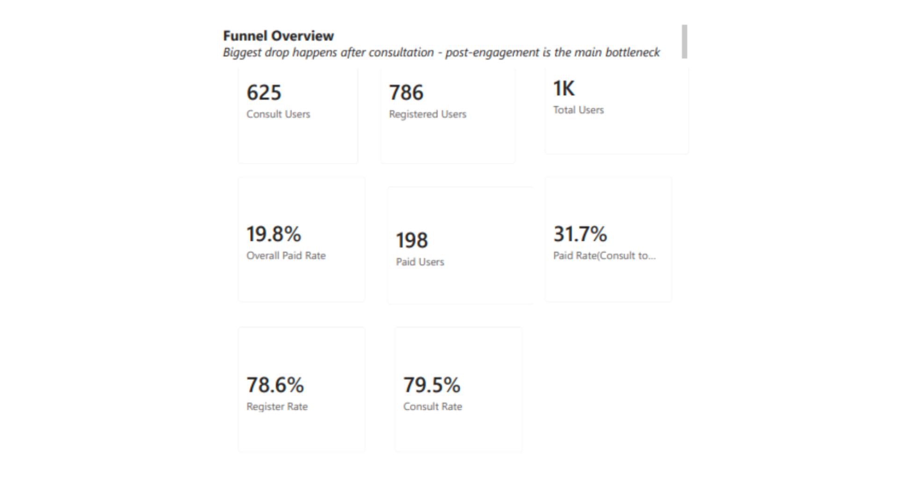
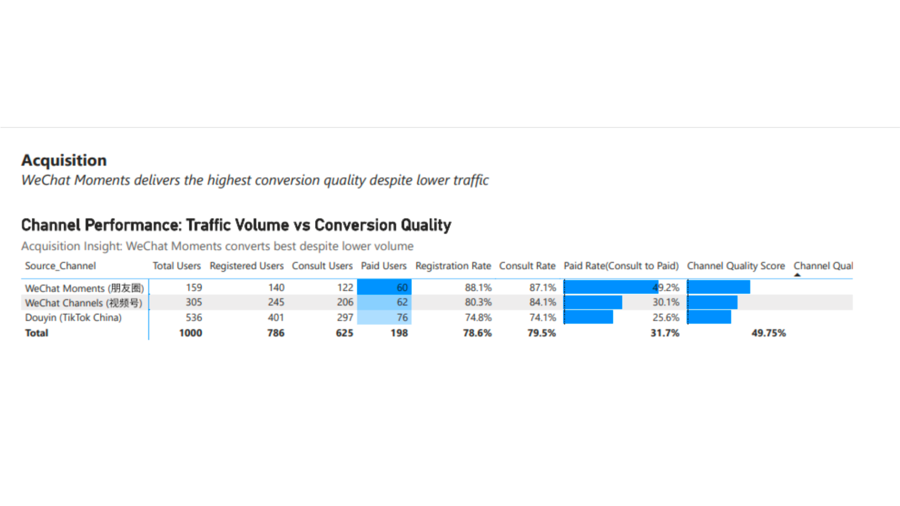
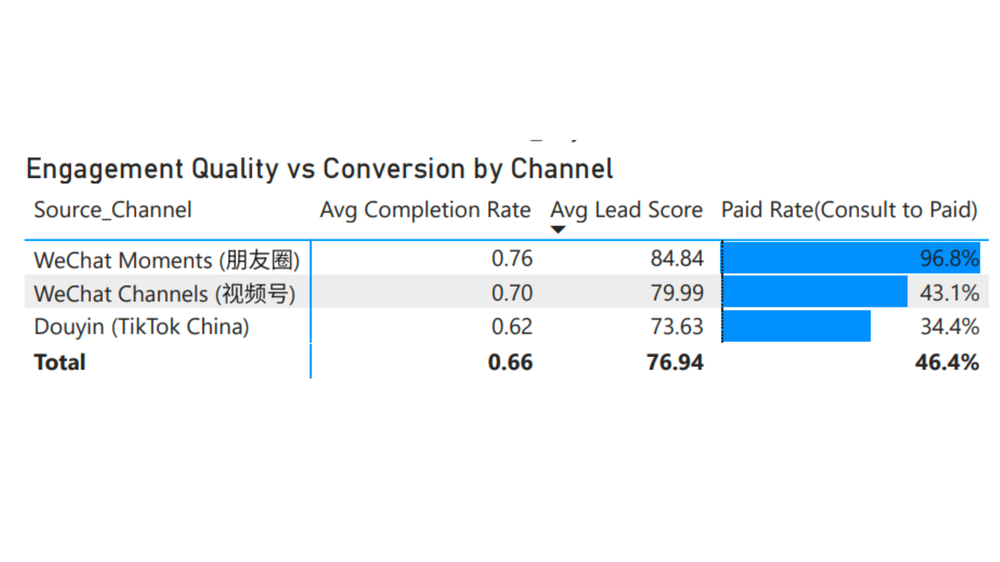
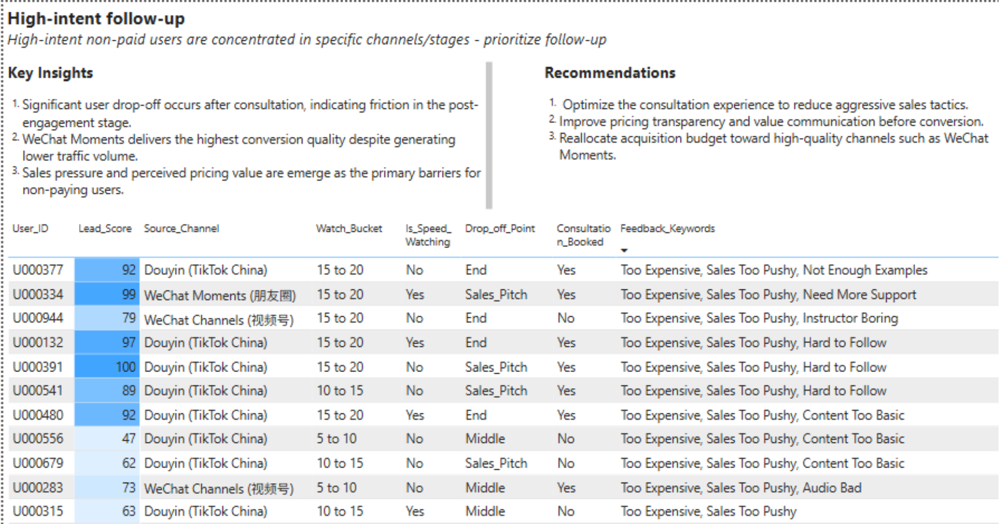

# Trial Course Conversion & Engagement Analysis

## 🎯 Project Objective
This dashboard analyses a free-to-paid marketing funnel for an online trial course (1,000 users). The primary goal is to identify user drop-off points, compare acquisition channel quality, and correlate user engagement (watch time) and feedback (VoC) with final conversion.

## 🛠️ Technical Stack & Workflow
- **Data Engineering (Python & Power Query):** Used Python to generate the raw dataset and Power Query to engineer 'Watch_Bucket' ranges and normalize feedback keywords for accurate counting.
- **Data Modeling:** Built a relational model in Power BI to track 1,000 users across four funnel stages: Watch, Register, Consult, and Paid.
- **Advanced DAX:** Developed measures to calculate conversion rates (e.g., Consult-to-Paid) and a weighted Channel Quality Score.

## 📊 Key Insights
- **Funnel Performance:** The overall conversion rate is 19.8%. The most significant friction point is the transition from **Consultation to Payment**.
- **Channel Quality:** **WeChat Moments** is the highest-performing channel with a 49% consult-to-paid rate, significantly outperforming Douyin and WeChat Channels.
- **User Engagement:** A strong correlation exists between engagement depth and payment; the paid rate peaks at approximately 42.9% for users in the **15–20 minute watch bucket**.
- **Top Blockers:** Non-paid users primarily cited sales pressure, pricing/value concerns, and content clarity as their main deterrents.

## 🖼️ Dashboard Preview

### Page 1: Funnel Overview
Focuses on overall health and identifying where the largest numeric loss occurs.

### Page 2: Acquisition Analysis
Compares channel traffic volume against conversion quality.

### Page 3: Engagement & VoC
Connects "what users do" (watch time) with "what they say" (feedback).

### Page 4: Actions & Recommendations
Summarizes findings and provides a high-intent follow-up list for targeted outreach.

