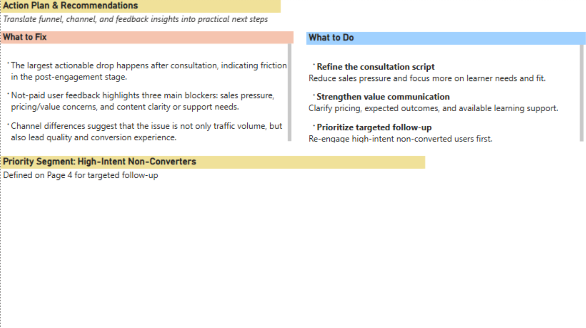

# Trial Course Conversion & Engagement Analysis

## 🎯 Project Objective
This dashboard analyzes a free-to-paid marketing funnel for an online trial course with 1,000 users. The project aims to identify where users drop off, compare acquisition channel quality, connect engagement and user feedback to conversion outcomes, and translate those findings into practical follow-up and business actions.

## 🛠️ Technical Stack & Workflow
- **Data Engineering (Python & Power Query):** Used Python to generate the raw dataset and Power Query to create `Watch_Bucket` ranges and normalize feedback keywords for analysis.
- **Data Modeling:** Built a Power BI data model to track 1,000 users across four funnel stages: Watch, Register, Consult, and Paid.
- **DAX Measures & Segmentation Logic:** Developed DAX measures for funnel conversion rates, consult-to-paid rate, and a weighted Channel Quality Score. Also created a rule-based segment in Power BI to identify **high-intent non-converted users** for priority follow-up.

## 📊 Key Insights
- **Funnel Performance:** The overall paid rate is **19.8%**, and the largest actionable drop occurs after consultation, making the post-engagement stage the main conversion bottleneck.
- **Channel Quality:** **WeChat Moments** delivers the highest conversion quality, with a much stronger consult-to-paid rate than Douyin and WeChat Channels despite lower traffic volume.
- **User Engagement:** Higher engagement is associated with stronger conversion outcomes. Users in the **15–20 minute watch bucket** show the highest paid rate.
- **User Feedback (VoC):** The main blockers for non-paid users are **sales pressure**, **pricing/value concerns**, and **content clarity or support needs**.
- **Target Segment for Follow-Up:** A practical follow-up segment was defined as **high-intent non-converted users** — not-paid users who still show at least two positive intent signals, such as high lead score, strong engagement, consultation reached, or a high-quality source channel.

## 🖼️ Dashboard Preview

### Page 1: Funnel Overview
Shows the overall funnel from Watch to Paid and highlights where the largest numeric drop occurs.

### Page 2: Acquisition Analysis
Compares channel traffic volume with conversion quality to identify which channels bring better users, not just more users.

### Page 3: Engagement & VoC
Connects user behavior (watch time and engagement depth) with user feedback to explain why some users convert and others do not.

### Page 4: High-Intent Non-Converters: Segment Definition
Defines a rule-based target segment for follow-up, shows how many users fall into this segment, and provides sample users for priority re-engagement.

### Page 5: Action Plan & Recommendations
Translates funnel, channel, and feedback insights into practical next steps, including improving the consultation experience, strengthening value communication, and prioritizing follow-up for high-intent non-converted users.

